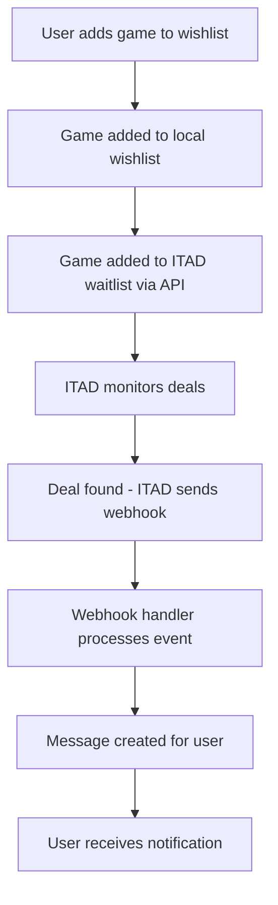

# ITAD (IsThereAnyDeal) Integration

Diese Dokumentation beschreibt die Integration der IsThereAnyDeal API für erweiterte Deal-Tracking und Webhook-basierte Benachrichtigungen.

## Übersicht

Die ITAD-Integration bietet:

- ✅ **Game-Suche** über ITAD API
- ✅ **Preis-Tracking** für Spiele über verschiedene Stores
- ✅ **Webhook-System** für Deal-Benachrichtigungen
- ✅ **Waitlist-Management** (ITAD-Seitig)
- ✅ **Store-Integration** mit bestehender Nexus-Architektur

## Setup

### 1. API-Schlüssel konfigurieren

```bash
# .env.local
ITAD_API_KEY="your-itad-api-key"
```

Den API-Schlüssel erhalten Sie von: https://isthereanydeal.com/dev/app/

### 2. Webhook-Endpoint konfigurieren

Der Webhook-Endpoint ist verfügbar unter:

```
https://your-domain.com/api/hook
```

Konfigurieren Sie diesen in Ihrem ITAD-Dashboard für folgende Events:

- `price_drop` - Preisverfall bei Spielen auf der Waitlist
- `new_deal` - Neue Deals für Waitlist-Spiele
- `free_game` - Kostenlose Spiele

## API-Services

### ITADService

Zentrale Klasse für ITAD API-Interaktion:

```typescript
// Spiele suchen
const games = await ITADService.searchGames({
  q: 'Cyberpunk 2077',
  limit: 10
});

// Preise abrufen
const prices = await ITADService.getGamePrices({
  plains: ['cyberpunk_2077'],
  country: 'DE'
});

// Zur Waitlist hinzufügen
await ITADService.addToWaitlist('cyberpunk_2077', 'user123');
```

### DealsService - ITAD Integration

Erweiterte Funktionen im bestehenden DealsService:

```typescript
// ITAD-Deals für ein Spiel synchronisieren
const deals = await DealsService.syncITADDealsForGame(
  gameId,
  steamAppId,
  gameName
);

// ITAD-Shops abrufen
const shops = await DealsService.getITADShops();
```

## TRPC API Endpoints

### Frontend-Integration über TRPC:

```typescript
// Spiele suchen
const games = await $client.deals.searchITADGames.query({
  query: 'Cyberpunk',
  limit: 20
});

// Preise abrufen
const prices = await $client.deals.getITADGamePrices.query({
  plains: ['cyberpunk_2077'],
  shops: ['steam', 'gog']
});

// Deals synchronisieren
const deals = await $client.deals.syncITADDealsForGame.mutate({
  gameId: 123,
  steamAppId: '1091500',
  gameName: 'Cyberpunk 2077'
});
```

## Pinia Store

### ITADStore

```typescript
const itadStore = useITADStore();

// Spiele suchen
await itadStore.searchGames('Cyberpunk 2077');

// Zur Waitlist hinzufügen
await itadStore.addToWaitlist('cyberpunk_2077', 'user123');

// Computed Properties nutzen
const hasResults = itadStore.hasSearchResults;
const waitlistCount = itadStore.waitlistCount;
```

## Webhook-System

### Webhook-Handler

Der Webhook-Handler in `/api/hook` verarbeitet automatisch ITAD-Events:

```typescript
// Automatische Event-Verarbeitung
POST /api/hook
{
  "event": "price_drop",
  "game": {
    "id": "cyberpunk_2077",
    "plain": "cyberpunk_2077",
    "title": "Cyberpunk 2077"
  },
  "deal": {
    "price": 29.99,
    "price_formatted": "29,99€",
    "price_old": 59.99,
    "price_old_formatted": "59,99€",
    "price_cut": 50,
    "shop": {
      "id": "steam",
      "name": "Steam"
    }
  }
}
```

### Event-Verarbeitung

Unterstützte Events:

- **price_drop**: Benachrichtigung bei Preisverfall
- **new_deal**: Benachrichtigung bei neuen Deals
- **free_game**: Benachrichtigung bei kostenlosen Spielen

## Datenfluss



## Integration mit bestehenden Features

### Wishlist-Integration

Die ITAD-Integration erweitert die bestehende Wishlist:

```typescript
// Beim Hinzufügen zur Wishlist auch zu ITAD hinzufügen
await WishlistService.addToWishlist(userId, gameId);
await ITADService.addToWaitlist(gamePlain, userId.toString());
```

### Deal-Synchronisation

ITAD-Deals werden in die lokale Datenbank synchronisiert:

```typescript
// Konvertierung in einheitliches Format
const unifiedDeals = ITADService.convertPricesToUnifiedFormat(itadPrices);

// Speicherung in lokaler DB
await DealsService.createOrUpdateDeal(dealData);
```

## Error Handling

Robuste Fehlerbehandlung auf allen Ebenen:

```typescript
try {
  const result = await ITADService.searchGames({ q: query });
  return result;
} catch (error) {
  console.error('ITAD API Error:', error);
  // Graceful fallback to local data
  return await DealsService.searchDeals({ gameTitle: query });
}
```

## Performance-Optimierungen

- **Caching**: Shops und häufige Suchanfragen werden gecacht
- **Batch-Requests**: Mehrere Spiele werden in einer Anfrage abgefragt
- **Debouncing**: Search-Requests werden verzögert um API-Limits zu respektieren
- **Lazy Loading**: ITAD-Daten werden nur bei Bedarf geladen

## Testing

```bash
# Webhook testen
curl -X POST http://localhost:3000/api/hook \
  -H "Content-Type: application/json" \
  -d '{
    "event": "price_drop",
    "game": {"id": "test", "plain": "test", "title": "Test Game"},
    "deal": {"price": 9.99, "price_formatted": "9,99€", "shop": {"name": "Steam"}}
  }'

# API testen
npm run dev
# Dann Frontend verwenden für ITAD-Suche und -Integration
```

## Limits & Quotas

ITAD API Limits (zu überprüfen):

- Requests pro Minute: ~60
- Requests pro Tag: ~5000
- Webhook-Limits: Abhängig vom Plan

## Troubleshooting

### Häufige Probleme:

1. **API Key fehlt**: Prüfen Sie die `.env.local` Konfiguration
2. **Webhook nicht erreichbar**: Prüfen Sie Firewall/Proxy-Einstellungen
3. **Rate Limiting**: Implementieren Sie Request-Delays
4. **Plain ID nicht gefunden**: Fallback auf Name-basierte Suche

### Debug-Logs:

```typescript
// Debug-Modus aktivieren
console.log('ITAD Request:', url.toString());
console.log('ITAD Response:', data);
```

## Roadmap

Geplante Erweiterungen:

- [ ] Erweiterte Filter für Deals
- [ ] Batch-Webhook-Verarbeitung
- [ ] User-spezifische Deal-Präferenzen
- [ ] Integration mit anderen Deal-APIs
- [ ] Historische Preis-Charts
