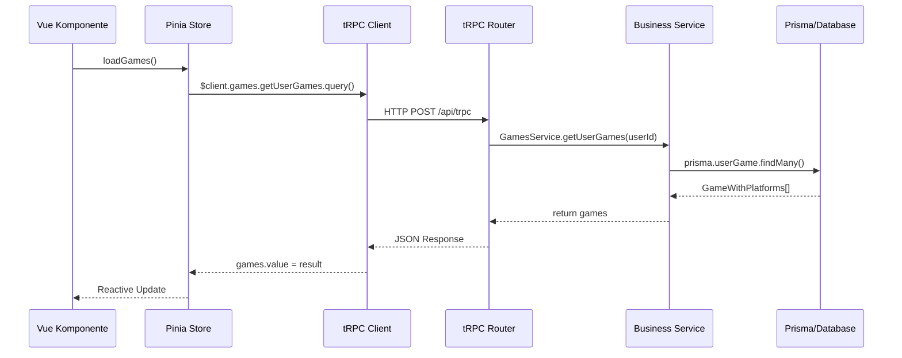

# Server-Kommunikation in modernen Full-Stack-Webanwendungen

## Einleitung: Warum ist Server-Kommunikation komplex?

### Das Problem traditioneller Webarchitekturen

In herkömmlichen Webarchitekturen entstehen oft folgende Herausforderungen:

- **Dateninkonsistenz** zwischen Frontend und Backend
- **Typunsicherheit** - Frontend weiß nicht, welche Daten vom Server kommen
- **Komplexe Fehlerbehandlung** über mehrere Schichten hinweg
- **Performance-Probleme** durch ineffiziente Datenabfragen
- **Entwicklungsaufwand** für API-Dokumentation und -Wartung

### Moderne Lösung: Type-Safe Full-Stack Development

Unser Ansatz kombiniert verschiedene moderne Technologien zu einer nahtlosen Kommunikationsarchitektur:

- **Einheitliche Typisierung** vom Frontend bis zur Datenbank
- **Automatische Synchronisation** zwischen Client und Server
- **Intelligente Datenabfragen** mit automatischer Optimierung
- **Zentrale Zustandsverwaltung** für konsistente Benutzeroberflächen

---

## Architekturübersicht: Die vier Kommunikationsschichten

### 1. Presentation Layer (Benutzeroberfläche)

**Rolle:** Darstellung und Benutzerinteraktion

- **Komponenten-basierte Architektur** - Jede UI-Komponente ist eigenständig und wiederverwendbar
- **Reaktive Updates** - Änderungen an Daten führen automatisch zu UI-Updates
- **Event-gesteuerte Kommunikation** - Benutzeraktionen triggern Datenoperationen

**Verantwortlichkeiten:**

- Benutzerinput erfassen
- Daten visuell darstellen
- Loading-Zustände und Fehler anzeigen

### 2. State Management Layer (Zustandsverwaltung)

**Rolle:** Zentrale Datenverwaltung und Orchestrierung

- **Single Source of Truth** - Alle Anwendungsdaten werden zentral verwaltet
- **Domänen-spezifische Stores** - Separate Datenverwaltung für verschiedene Bereiche (Games, Deals, User)
- **Automatische Caching-Strategien** - Intelligente Zwischenspeicherung für bessere Performance

**Verantwortlichkeiten:**

- Client-seitigen Zustand verwalten
- Server-Kommunikation koordinieren
- Daten zwischen Komponenten teilen
- Optimistic Updates durchführen

### 3. Communication Layer (Kommunikationsschicht)

**Rolle:** Type-safe Verbindung zwischen Frontend und Backend

- **End-to-End Typisierung** - Gleiche Datentypen im Frontend und Backend
- **Automatische Request-Optimierung** - Mehrere Anfragen werden intelligent gebündelt
- **Procedure-basierte API** - Funktionsaufrufe statt HTTP-Endpunkte

**Verantwortlichkeiten:**

- Daten zwischen Client und Server übertragen
- Requests automatisch bündeln (Batching)
- Fehler standardisiert behandeln
- Datenvalidierung auf beiden Seiten

### 4. Business Logic Layer (Geschäftslogik)

**Rolle:** Domänen-spezifische Geschäftsregeln und Datenverarbeitung

- **Service-orientierte Architektur** - Klare Trennung verschiedener Geschäftsbereiche
- **Transaktionale Operationen** - Sichere Datenbank-Operationen
- **External API Integration** - Anbindung externer Services (z.B. Game-Datenbanken)

**Verantwortlichkeiten:**

- Geschäftsregeln implementieren
- Datenvalidierung und -transformation
- Externe Service-Integration
- Komplexe Datenbank-Operationen

---

## Kommunikationsfluss: Wie Daten durch die Architektur fließen

### Sequenzdiagramm: Vollständiger Datenfluss

### Schritt-für-Schritt Erklärung

#### 1. Benutzerinteraktion startet den Prozess

- Benutzer navigiert zu einer Seite oder klickt einen Button
- UI-Komponente erkennt, dass Daten benötigt werden
- Komponente ruft entsprechende Funktion im State Management auf

#### 2. State Management orchestriert die Anfrage

- Store-Funktion wird aufgerufen (z.B. "loadGames")
- Store setzt Loading-Zustand und bereitet Fehlerbehandlung vor
- Anfrage wird an die Kommunikationsschicht weitergeleitet

#### 3. Type-Safe Kommunikation zum Server

- Client erstellt typisierte Anfrage an spezifische "Procedure"
- Automatische Serialisierung komplexer Datentypen
- Request wird über HTTP an Server-Router gesendet

#### 4. Server-Router leitet an Business Service weiter

- Router empfängt Anfrage und validiert Parameter
- Benutzerauthentifikation und -berechtigung werden geprüft
- Anfrage wird an entsprechenden Business Service delegiert

#### 5. Business Service implementiert Geschäftslogik

- Service führt domänen-spezifische Validierungen durch
- Komplexe Datenbank-Abfragen mit Relationen werden ausgeführt
- Daten werden für Frontend-Consumption aufbereitet

#### 6. Antwort fließt zurück durch alle Schichten

- Datenbank liefert Rohdaten an Service
- Service transformiert und strukturiert Daten
- Router serialisiert Antwort für Client
- Client empfängt typisierte Daten
- Store aktualisiert lokalen Zustand
- UI wird automatisch aktualisiert

---

## Schlüsseltechnologien und ihre Rollen

### Frontend Framework: Vue.js mit Nuxt

**Was es löst:** Reaktive Benutzeroberflächen und Server-Side Rendering

- **Reaktivität** - Automatische UI-Updates bei Datenänderungen
- **Komponenten-System** - Wiederverwendbare, isolierte UI-Bausteine
- **Server-Side Rendering** - Bessere Performance und SEO
- **File-based Routing** - Automatische URL-Struktur basierend auf Dateien

### State Management: Pinia

**Was es löst:** Zentrale, vorhersagbare Zustandsverwaltung

- **Store-Pattern** - Zentrale Datenhaltung für die gesamte Anwendung
- **Kompositions-API** - Moderne, funktionale Programmierung
- **DevTools Integration** - Debugging und Zeitreise-Funktionen
- **TypeScript-First** - Vollständige Typsicherheit

### API Communication: tRPC

**Was es löst:** Type-safe Client-Server-Kommunikation

- **End-to-End Typisierung** - Gleiche Typen im Frontend und Backend
- **Procedure-basiert** - Funktionsaufrufe statt REST-Endpunkte
- **Automatische Validierung** - Input/Output-Validierung zur Laufzeit
- **Request Batching** - Automatische Optimierung mehrerer Anfragen

### Data Access: Prisma ORM

**Was es löst:** Type-safe Datenbankzugriff mit modernen Features

- **Schema-First Development** - Datenbank-Schema als Single Source of Truth
- **Auto-Generated Client** - Typisierte Datenbankabfragen
- **Migration System** - Versionierte Datenbankänderungen
- **Relation Management** - Einfache Handhabung komplexer Datenbeziehungen

---

## Zusammenfassung: Die Kommunikationsarchitektur

### Wie funktioniert die Zusammenarbeit der Komponenten?

**Die vier Schichten arbeiten nahtlos zusammen:**

1. **UI-Komponenten** zeigen Daten an und erfassen Benutzereingaben
2. **Pinia Stores** verwalten den Anwendungszustand zentral und koordinieren Server-Anfragen
3. **tRPC** sorgt für typsichere Kommunikation zwischen Frontend und Backend
4. **Business Services** implementieren die Geschäftslogik und greifen auf die Datenbank zu

### Kernvorteile dieser Architektur

- **Typsicherheit** - Fehler werden zur Entwicklungszeit erkannt, nicht zur Laufzeit
- **Automatische Synchronisation** - UI Updates erfolgen automatisch bei Datenänderungen
- **Performance-Optimierung** - Intelligente Request-Bündelung und Caching
- **Entwicklerfreundlichkeit** - Weniger Boilerplate-Code, bessere IDE-Unterstützung

Diese Architektur ermöglicht es, komplexe Webanwendungen mit hoher Entwicklungsgeschwindigkeit und niedriger Fehlerrate zu erstellen, indem sie moderne TypeScript-Technologien intelligent miteinander verbindet.
