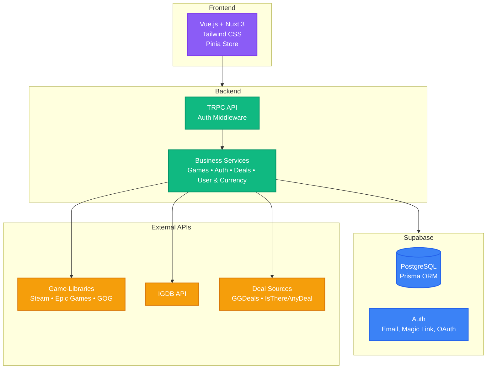
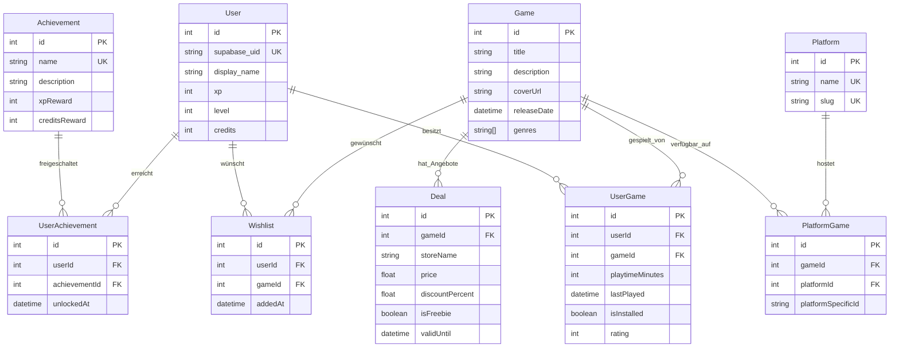

# Nexus – Technische Präsentation

**Zentrale Vision:** Eine zentrale Gaming-Bibliotheksverwaltung, die durch Gamification-Elemente angereichert wird.

---

## 1. Softwarearchitektur

Nexus folgt einer modernen Full-Stack-Webarchitektur mit einer klaren Trennung von Frontend, Backend und Datenschicht.

### Architektur-Prinzipien

- **Service-orientierte Architektur:** Die Funktionalität ist in klar abgegrenzte, spezialisierte Services aufgeteilt.
- **Type-Safe APIs:** Einsatz von tRPC für eine vollständig typsichere Client-Server-Kommunikation, um Fehler zur Build-Zeit zu erkennen.
- **Modulare Struktur:** Strikte Trennung von Business Logic, User Interface (UI) und Datenzugriffsschicht (Data Access Layer).

### Datenmodell (Kern-Entitäten)

- **User:** Der zentrale Benutzer mit Gamification-Attributen (XP, Level, Credits).
- **Game:** Die Spielentität, angereichert mit umfangreichen Metadaten über die IGDB-API.
- **Platform:** Die unterstützten Gaming-Plattformen (z. B. Steam, Epic Games, GOG).
- **Deal:** Repräsentiert Angebote und Rabatte, die von externen Deal-APIs aggregiert werden.

---

## 2. Eingesetzte Technologien und Frameworks

### Frontend Stack

- **Vue.js 3:** Reaktives UI-Framework unter Nutzung der Composition API.
- **Nuxt 3:** Full-Stack-Framework für Server-Side Rendering (SSR), Static Site Generation (SSG) und API-Routen.
- **Tailwind CSS:** Utility-First-CSS-Framework für schnelles und konsistentes UI-Design.
- **Pinia:** Modernes und leichtgewichtiges State Management für Vue.js.

### Backend & Datenbank

- **Supabase:** Backend-as-a-Service-Plattform, die PostgreSQL, Authentifizierung und Storage bereitstellt.
- **Prisma ORM:** Next-Generation-ORM für den typsicheren Datenbankzugriff und einfache Schema-Migrationen.
- **tRPC:** Ermöglicht den Aufbau von typsicheren APIs ohne Notwendigkeit der Schema-Generierung.

### Development & Build Tools

- **TypeScript:** Statische Typisierung über den gesamten Stack hinweg.
- **ESLint & Prettier:** Sicherstellung von Code-Qualität und einheitlicher Formatierung.

---

## 3. Externe Integrationen

### Kern-Schnittstellen (APIs)

- **Game-Library APIs:** Für den Import von Bibliotheken und Spieldaten (z. B. Steam, Epic Games).
- **IGDB API:** Zur Anreicherung von Spieldaten mit Metadaten (Cover, Beschreibungen, Genres etc.).
- **Deal-APIs:** Für den Import von aktuellen Rabatten und Freebies (z. B. IsThereAnyDeal, Epic Games Store API).
- **OAuth2:** Für die sichere Authentifizierung gegenüber den externen APIs.

### Deal Aggregation System

- Kontinuierliche Abfrage von Deals über angebundene APIs.
- Vergleich und Auswertung der Ergebnisse zur Ermittlung der besten Angebote.
- Automatische Bereinigung und Filterung von alten, abgelaufenen oder irrelevanten Deals.

### Geplante Integrationen

- **Payment Gateway (z. B. Stripe):** Für den Kauf von In-Game-Credits.
- **Affiliate Networks:** Zur Monetarisierung der Plattform über Deal-Verlinkungen.

---

## 4. Funktionsumfang bis 24.07. (MVP)

### MUST-HAVES

- **Benutzerauthentifizierung:** Sicherer Login und Registrierung über Supabase Auth.
- **Bibliotheksimport (Steam & Epic Games Store):**
  - Prävention von Duplikaten auf Datenbankebene.
  - Automatische Anreicherung der importierten Spiele mit IGDB-Metadaten.
- **Spielebibliotheks-Management:**
  - Filter- und sortierbare Übersicht aller Spiele.
  - Tracking und Anzeige der individuellen Spielzeit.
- **Deal-System:**
  - Anzeige von Deals mit Kategorisierung und Filteroptionen.
  - Tracking der Preisentwicklung für ausgewählte Spiele.

### NICE-TO-HAVES

- **Erweiterte Gamification:**
  - Achievement-System mit Freischaltungslogik.
  - XP-Berechnung basierend auf Nutzeraktivitäten (z. B. Spielen, Deals nutzen).
  - Level-System mit visueller Fortschrittsanzeige.
- **GOG-Import:** Integration von DRM-freien Spielen.
- **Wunschlisten-System:** Spiele vormerken und bei Angeboten benachrichtigt werden.
- **Erweiterte Statistiken:** Detaillierte Analysen der Spielzeit und Bibliothek.
- **Social Features:** Freundesystem und Vergleich von Bibliotheken oder Achievements.

---

## 5. Zukunftsaussichten & Skalierung

### Geplante Features

- **Payment Gateway (Stripe):** Implementierung von Credit-Käufen.
- **Affiliate-Integration:** Monetarisierung über qualifizierte Deal-Links.
- **Desktop App (Electron):** Bereitstellung einer nativen Anwendung für eine tiefere OS-Integration.
- **Advanced Gamification:** Einführung von Ranglisten, kosmetischen Items und Belohnungssystemen.

### Geplante technische Skalierung

- **Caching:** Einsatz von Redis für das Caching von häufigen API-Antworten.
- **Queue System:** Nutzung von Background Jobs für zeitintensive Aufgaben wie die Deal-Aggregation.
- **Monitoring:** Integration von Sentry für proaktives Error-Tracking und Performance-Monitoring.

---

## 6. Aktueller Entwicklungsstand

- **Abgeschlossen:** Authentifizierung & Benutzerverwaltung.
- **In Arbeit:** Steam-Integration & Bibliotheksverwaltung.
- **In Arbeit:** System zur Anreicherung mit IGDB-Metadaten.
- **Implementiert:** Grundlegendes UI/UX-System mit responsivem Gaming-Design.
- **Implementiert:** Basis für Loading States und Error Handling.
