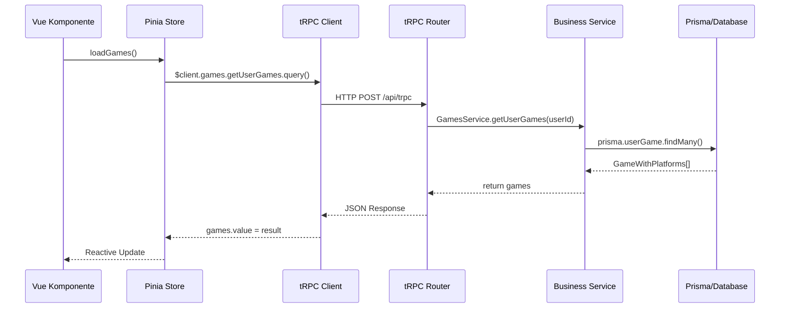

# Technischer Schwerpunkt: Frontend-Backend-Kommunikation in modernen Full-Stack-Architekturen

## Übersicht des Schwerpunktthemas

**Kernfrage:** Wie funktioniert die nahtlose Kommunikation zwischen Frontend, Business Services und Backend in einer modernen TypeScript-basierten Webarchitektur?

**Fokus:** Der komplette Datenfluss von der UI-Komponente über Pinia Stores, tRPC-APIs bis zu den Backend-Services und der Datenbank.

---

## 1. Kommunikationsarchitektur im Überblick



### Schichten-Übersicht

1. **Presentation Layer:** Vue-Komponenten + Pinia Stores
2. **Communication Layer:** tRPC Client/Server
3. **Business Logic Layer:** Service-Klassen
4. **Data Access Layer:** Prisma ORM + PostgreSQL

---

## 2. Detaillierte Kommunikationsflows

### Frontend → Store → Service: Request Flow

```typescript
// 1. Vue Komponente initiiert Request
// components/GameLibrary.vue
<script setup>
const gamesStore = useGamesStore();
const { games, loading } = storeToRefs(gamesStore);

onMounted(() => {
  gamesStore.loadGames(); // Trigger für Datenabfrage
});
</script>

// 2. Pinia Store orchestriert die Kommunikation
// stores/games.store.ts
export const useGamesStore = defineStore('games', () => {
  const games = ref<GameWithPlatforms[]>([]);
  const { $client } = useNuxtApp();

  const loadGames = async () => {
    try {
      // tRPC-Call mit automatischer Typsicherheit
      const result = await $client.games.getUserGames.query();
      games.value = result;
    } catch (error) {
      // Zentralisierte Fehlerbehandlung
      handleError(error);
    }
  };

  return { games: readonly(games), loadGames };
});

// 3. tRPC Router leitet an Business Service weiter
// server/trpc/routers/games.router.ts
export const gamesRouter = router({
  getUserGames: protectedProcedure.query(async ({ ctx }) => {
    // Direkter Service-Aufruf mit Context-Übergabe
    return await GamesService.getUserGames(ctx.dbUser.id);
  })
});

// 4. Business Service implementiert die Geschäftslogik
// lib/services/games.service.ts
export namespace GamesService {
  export async function getUserGames(userId: number): Promise<GameWithPlatforms[]> {
    // Prisma-Query mit Include-Joins
    const userGames = await prisma.userGame.findMany({
      where: { userId },
      include: {
        game: {
          include: {
            platformGames: { include: { platform: true } }
          }
        }
      }
    });

    // Business Logic: Datenaufbereitung für Frontend
    return userGames.map(transformToGameWithPlatforms);
  }
}
```

### Backend → Frontend: Response Flow

```typescript
// 1. Service bereitet Daten auf
const transformToGameWithPlatforms = (userGame): GameWithPlatforms => ({
  id: userGame.game.id,
  userGameId: userGame.id,
  title: userGame.game.title,
  platforms: userGame.game.platformGames.map(pg => pg.platform.name),
  playtimeMinutes: userGame.playtimeMinutes || 0,
  // ... weitere Aufbereitung
});

// 2. tRPC serialisiert mit SuperJSON
// Automatische Behandlung von Date, BigInt, undefined etc.
const client = createTRPCNuxtClient<AppRouter>({
  transformer: superjson, // Date-Objekte bleiben Date-Objekte
});

// 3. Pinia Store erhält typsichere Daten
// Keine Runtime-Validierung nötig - TypeScript garantiert Korrektheit
games.value = result; // result ist bereits GameWithPlatforms[]

// 4. Vue Komponente reagiert automatisch
// Durch Vue's Reactivity werden UI-Updates automatisch getriggert
<template>
  <div v-for="game in games" :key="game.id">
    {{ game.title }} <!-- Automatisches Update bei Datenänderung -->
  </div>
</template>
```

---

## 3. Komplexe Kommunikationsszenarien

### Szenario 1: Langwierige Operationen mit Progress-Updates

```typescript
// 1. Frontend startet Import-Operation
// stores/games.store.ts
const importGames = async (platform: string) => {
  // Server-Sent Events für Progress-Updates
  const progressComposable = useServerProgress();

  try {
    // tRPC-Mutation startet Background-Operation
    const result = await $client.games.importGames.mutate({
      platform,
      operationId: generateUniqueId()
    });

    // Parallel Progress-Updates empfangen
    progressComposable.connectToProgress(result.operationId);

  } catch (error) {
    handleImportError(error);
  }
};

// 2. tRPC Router startet Background-Job
// server/trpc/routers/games.router.ts
importGames: protectedProcedure
  .input(z.object({ platform: z.string(), operationId: z.string() }))
  .mutation(async ({ input, ctx }) => {
    // Service-Call mit Progress-Callback
    const result = await GamesService.importFromPlatform(
      ctx.dbUser.id,
      input.platform,
      (progress) => sendProgressUpdate(input.operationId, progress)
    );

    return { success: true, operationId: input.operationId };
  }),

// 3. Service führt Operation mit Progress-Updates aus
// lib/services/games.service.ts
export async function importFromPlatform(
  userId: number,
  platform: string,
  onProgress: (progress: ProgressUpdate) => void
) {
  const games = await fetchGamesFromAPI(platform);

  for (let i = 0; i < games.length; i++) {
    await processGame(games[i]);

    // Progress-Update an Frontend
    onProgress({
      current: i + 1,
      total: games.length,
      message: `Verarbeite ${games[i].title}...`
    });
  }
}

// 4. Frontend erhält Updates via Server-Sent Events
// composables/useServerProgress.ts
export const useServerProgress = () => {
  const currentProgress = ref<ProgressUpdate | null>(null);

  const connectToProgress = (operationId: string) => {
    const eventSource = new EventSource(`/api/progress/${operationId}`);

    eventSource.onmessage = event => {
      const update = JSON.parse(event.data);
      currentProgress.value = update; // Reaktive UI-Updates
    };
  };

  return { currentProgress, connectToProgress };
};
```

### Szenario 2: Optimistic Updates mit Rollback

```typescript
// 1. Frontend führt optimistic Update durch
// stores/games.store.ts
const removeGame = async (gameId: number) => {
  // Backup für Rollback
  const gameBackup = games.value.find(g => g.id === gameId);

  // Optimistic Update - sofortige UI-Änderung
  games.value = games.value.filter(g => g.id !== gameId);

  try {
    // Server-Update
    await $client.games.removeGame.mutate({ gameId });
  } catch (error) {
    // Rollback bei Fehler
    if (gameBackup) {
      games.value.push(gameBackup);
    }
    throw error;
  }
};

// 2. tRPC Router mit Transaktionslogik
// server/trpc/routers/games.router.ts
removeGame: protectedProcedure
  .input(z.object({ gameId: z.number() }))
  .mutation(async ({ input, ctx }) => {
    // Service mit Transaction-Support
    return await GamesService.removeUserGame(ctx.dbUser.id, input.gameId);
  }),

// 3. Service mit Fehlerbehandlung und Rollback
// lib/services/games.service.ts
export async function removeUserGame(userId: number, gameId: number) {
  return await prisma.$transaction(async (tx) => {
    // Validation
    const userGame = await tx.userGame.findFirst({
      where: { userId, gameId }
    });

    if (!userGame) {
      throw new TRPCError({
        code: 'NOT_FOUND',
        message: 'Spiel nicht in Bibliothek gefunden'
      });
    }

    // Actual deletion
    await tx.userGame.delete({
      where: { id: userGame.id }
    });

    return { success: true };
  });
}
```

### Szenario 3: Caching und Query-Invalidation

```typescript
// 1. tRPC Client mit automatischem Caching
// plugins/trpcClient.ts
const client = createTRPCNuxtClient<AppRouter>({
  links: [
    httpBatchLink({
      url: '/api/trpc',
      // Automatisches Request-Batching
      maxBatchSize: 10,
    })
  ],
  transformer: superjson,
});

// 2. Store mit intelligenter Cache-Invalidation
// stores/games.store.ts
const addGameToLibrary = async (gameData: NewGameData) => {
  // Mutation mit automatischer Query-Invalidation
  await $client.games.addGame.mutate(gameData);

  // Relevante Queries invalidieren
  await $client.games.getUserGames.invalidate();
  await $client.games.getGameStats.invalidate();

  // Lokaler State wird automatisch aktualisiert
};

// 3. Komponente mit reaktiven Updates
// components/GameLibrary.vue
<script setup>
// Automatische Subscription auf Store-Änderungen
const { games, stats } = storeToRefs(useGamesStore());

// Watch für manuelle Reaktionen
watch(games, (newGames) => {
  // UI-spezifische Logic bei Datenänderung
  updateGameGrid(newGames);
});
</script>
```

---

## 4. Kommunikations-Patterns & Lessons Learned

### ✅ Erfolgreiche Kommunikations-Patterns

#### 1. **Centralized State Management über Pinia Stores**

```typescript
// Lesson: Ein Store pro Domäne, nicht pro Komponente
const useGamesStore = defineStore('games', () => {
  // Zentraler State für alle Game-bezogenen Daten
  const games = ref<GameWithPlatforms[]>([]);
  const selectedGame = ref<GameWithPlatforms | null>(null);
  const filters = ref<GameFilters>({ platform: 'all' });

  // Alle Game-Operationen in einem Store
  const loadGames = async () => {
    /* ... */
  };
  const selectGame = (game: GameWithPlatforms) => {
    /* ... */
  };
  const applyFilters = (newFilters: GameFilters) => {
    /* ... */
  };

  return { games, selectedGame, filters, loadGames, selectGame, applyFilters };
});
```

**Erfahrung:** Store-per-Domain-Ansatz reduziert Kommunikations-Overhead zwischen Komponenten.

#### 2. **Typsichere Procedure-Chains**

```typescript
// Lesson: Procedures können andere Procedures aufrufen
// server/trpc/routers/games.router.ts
export const gamesRouter = router({
  // Basis-Procedures
  getUserGames: protectedProcedure.query(async ({ ctx }) => {
    return await GamesService.getUserGames(ctx.dbUser.id);
  }),

  // Composed Procedures
  getGamesWithStats: protectedProcedure.query(async ({ ctx }) => {
    // Wiederverwendung von Service-Logic
    const games = await GamesService.getUserGames(ctx.dbUser.id);
    const stats = await GamesService.getUserStats(ctx.dbUser.id);

    return { games, stats }; // Automatische Typsicherheit
  })
});
```

**Erfahrung:** Procedure-Komposition ermöglicht effiziente Datenabfragen ohne N+1-Problem.

#### 3. **Reactive Error Boundaries**

```typescript
// Lesson: Fehlerbehandlung auf Store-Level
// stores/games.store.ts
export const useGamesStore = defineStore('games', () => {
  const error = ref<string | null>(null);
  const isLoading = ref(false);

  const loadGames = async () => {
    try {
      isLoading.value = true;
      error.value = null;

      const result = await $client.games.getUserGames.query();
      games.value = result;
    } catch (err) {
      // Zentrale Fehlerbehandlung
      error.value = formatUserError(err);

      // Fallback-Daten
      games.value = getCachedGames();
    } finally {
      isLoading.value = false;
    }
  };

  return { games, error, isLoading, loadGames };
});
```

**Erfahrung:** Store-Level Error Handling + Fallback-Strategien verbessern UX erheblich.

### ⚠️ Kommunikations-Herausforderungen

#### 1. **Hydration Mismatches bei SSR**

**Problem:** Server und Client haben unterschiedliche Daten-Zustände

```typescript
// Problematisch: Store-Initialisierung vor Hydration
const gamesStore = useGamesStore();
gamesStore.loadGames(); // Kann zu Hydration-Mismatch führen

// Lösung: Explizite Hydration-Synchronisation
// stores/games.store.ts
export const useGamesStore = defineStore('games', () => {
  const games = ref<GameWithPlatforms[]>([]);
  const isHydrated = ref(false);

  const ensureHydration = async () => {
    if (process.server) {
      // Server: Daten prefetchen
      const serverGames = await GamesService.getUserGames(userId);
      games.value = serverGames;
    } else if (!isHydrated.value) {
      // Client: Nach Hydration laden
      await loadGames();
      isHydrated.value = true;
    }
  };

  return { games, ensureHydration };
});
```

**Lesson Learned:** Explizite Hydration-Kontrolle verhindert State-Inconsistencies.

#### 2. **Memory Leaks bei Long-Running Operations**

**Problem:** EventSource-Verbindungen werden nicht korrekt geschlossen

```typescript
// Problematisch: Keine Cleanup-Logic
const connectToProgress = (operationId: string) => {
  const eventSource = new EventSource(`/api/progress/${operationId}`);
  // Keine Cleanup-Strategie
};

// Lösung: Composable mit Lifecycle-Management
// composables/useServerProgress.ts
export const useServerProgress = () => {
  let eventSource: EventSource | null = null;

  const connectToProgress = (operationId: string) => {
    // Alte Verbindung schließen
    if (eventSource) {
      eventSource.close();
    }

    eventSource = new EventSource(`/api/progress/${operationId}`);

    // Automatisches Cleanup
    eventSource.addEventListener('end', () => {
      eventSource?.close();
      eventSource = null;
    });
  };

  // Vue Lifecycle Integration
  onUnmounted(() => {
    eventSource?.close();
  });

  return { connectToProgress };
};
```

**Lesson Learned:** Explizites Lifecycle-Management ist bei Realtime-Kommunikation essentiell.

#### 3. **Performance bei großen Datenmengen**

**Problem:** Große Game-Bibliotheken führen zu langsamen UI-Updates

```typescript
// Problematisch: Alle Daten auf einmal laden
const loadGames = async () => {
  const games = await $client.games.getUserGames.query(); // 1000+ Games
  games.value = games; // Blockiert UI
};

// Lösung: Paginierung + Virtualisierung
// stores/games.store.ts
export const useGamesStore = defineStore('games', () => {
  const games = ref<GameWithPlatforms[]>([]);
  const hasMore = ref(true);
  const page = ref(0);

  const loadGamesPage = async (pageSize: number = 50) => {
    const result = await $client.games.getUserGamesPaginated.query({
      page: page.value,
      pageSize
    });

    // Append statt Replace
    games.value.push(...result.games);
    hasMore.value = result.hasMore;
    page.value++;
  };

  return { games, hasMore, loadGamesPage };
});
```

**Lesson Learned:** Paginierung + Lazy Loading sind bei großen Datenmengen unerlässlich.

---

## 5. Architektur-Empfehlungen

### Kommunikations-Architektur Best Practices

#### 1. **Separation of Concerns**

```
UI Layer (Vue Components)
├── Presentation Logic only
├── Event Handling
└── Reactive Data Display

State Layer (Pinia Stores)
├── Client State Management
├── Server Communication
└── Business Logic Coordination

Communication Layer (tRPC)
├── Type-Safe API Contracts
├── Request/Response Transformation
└── Error Handling

Service Layer (Business Services)
├── Domain Logic
├── Data Validation
└── External API Integration

Data Layer (Prisma + Database)
├── Data Persistence
├── Relationships
└── Constraints
```

#### 2. **Data Flow Principles**

- **Unidirectional Flow:** Daten fließen immer von Store → Component
- **Single Source of Truth:** Ein Store pro Domäne
- **Reactive Updates:** Automatic UI updates bei State-Änderungen
- **Optimistic Updates:** UI-Updates vor Server-Bestätigung

#### 3. **Error Handling Strategy**

- **Store-Level:** Zentrale Fehlerbehandlung pro Domäne
- **Component-Level:** UI-spezifische Fehlerdarstellung
- **Service-Level:** Business Logic Validierung
- **Global Level:** Unbehandelte Fehler via Error Boundary

### Performance-Optimierungen

#### Request Batching

```typescript
// tRPC automatisches Batching
const client = createTRPCNuxtClient<AppRouter>({
  links: [
    httpBatchLink({
      url: '/api/trpc',
      maxBatchSize: 10 // Bis zu 10 Requests zusammenfassen
    })
  ]
});

// Resultat: Mehrere gleichzeitige Requests werden gebündelt
await Promise.all([
  $client.games.getUserGames.query(),
  $client.deals.getDeals.query(),
  $client.auth.getProfile.query()
]); // Ein einziger HTTP-Request
```

#### Intelligent Caching

```typescript
// Store mit Cache-Strategie
export const useGamesStore = defineStore('games', () => {
  const gamesCache = ref(new Map<string, GameWithPlatforms[]>());
  const cacheTimestamp = ref(new Map<string, number>());

  const loadGames = async (filters: GameFilters = {}) => {
    const cacheKey = JSON.stringify(filters);
    const cached = gamesCache.value.get(cacheKey);
    const timestamp = cacheTimestamp.value.get(cacheKey);

    // Cache für 5 Minuten gültig
    if (cached && timestamp && Date.now() - timestamp < 300000) {
      games.value = cached;
      return;
    }

    // Fresh data fetch
    const result = await $client.games.getUserGames.query(filters);
    gamesCache.value.set(cacheKey, result);
    cacheTimestamp.value.set(cacheKey, Date.now());
    games.value = result;
  };
});
```

---

## 6. Fazit: Kommunikations-Architektur

### Erfolgs-Faktoren der Kommunikationsarchitektur

**1. Type Safety als Fundament**

- Compile-Zeit-Sicherheit eliminiert API-Kommunikationsfehler
- Automatische Code-Completion und Refactoring-Support
- Keine Runtime-Schema-Validierung erforderlich

**2. Reaktive State-Synchronisation**

- Automatische UI-Updates bei Datenänderungen
- Optimistic Updates für bessere User Experience
- Zentrale Fehlerbehandlung auf Store-Level

**3. Performance durch intelligente Patterns**

- Request-Batching reduziert HTTP-Overhead
- Selective Cache-Invalidation verhindert unnecessary Refetches
- Progressive Loading für große Datenmengen

### Kritische Erkenntnisse

**Wann funktioniert diese Architektur optimal?**
✅ **Komplexe Datenflüsse** mit vielen UI-State-Synchronisationen
✅ **Team-Entwicklung** mit starker TypeScript-Expertise  
✅ **Performance-kritische Anwendungen** mit vielen parallelen Requests

**Wo sind die Grenzen?**
❌ **Einfache CRUD-Anwendungen** - Overhead überwiegt Nutzen
❌ **Legacy-Integration** - Schwierige Anbindung bestehender REST-APIs
❌ **Real-Time Heavy** - WebSockets sind oft effizienter als SSE

### Technologie-Empfehlungen

**Diese Kombination wählen wenn:**

- TypeScript-First Entwicklung
- Komplexe Frontend-State Management
- Hohe Entwicklergeschwindigkeit gewünscht
- End-to-End Typsicherheit erforderlich

**Alternative Ansätze für:**

- **GraphQL + Apollo:** Bei komplexen Query-Requirements
- **REST + TanStack Query:** Bei bestehenden REST-APIs
- **WebSockets + Zustand:** Bei Realtime-Heavy Applications

### Ausblick: Evolution der Frontend-Backend-Kommunikation

Die Kombination aus Nuxt 3, Pinia und tRPC repräsentiert eine Evolution hin zu **Full-Stack TypeScript Development**, bei der die Grenzen zwischen Frontend und Backend durch gemeinsame Typisierung verschwimmen.

**Nächste Entwicklungsstufen:**

- **Edge Computing Integration:** Verteilte Service-Execution
- **Streaming Responses:** Für Large Language Model Integration
- **Micro-Frontend Architecture:** Service-per-Team-Ansätze

Diese Architektur ermöglicht es Entwicklungsteams, komplexe Webanwendungen mit hoher Entwicklungsgeschwindigkeit und geringer Fehlerrate zu erstellen.
